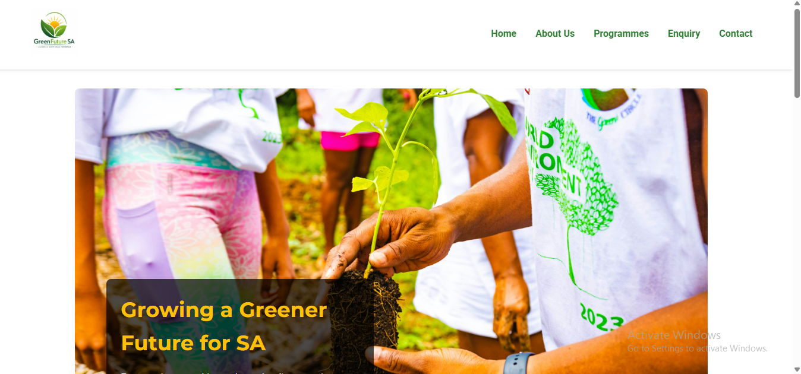
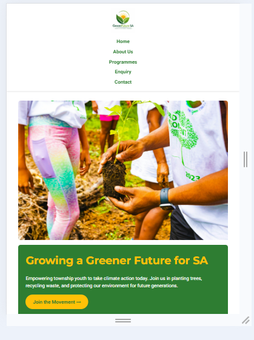
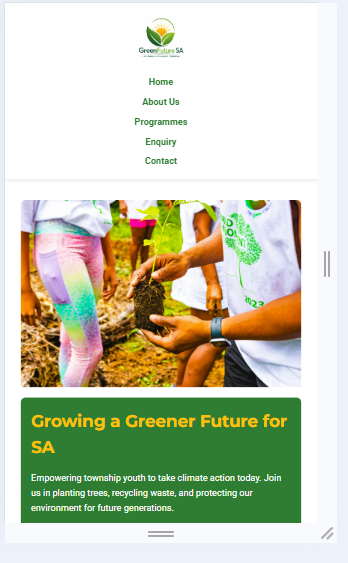

# GreenFuture SA Website

## Student Information
- **Name:** Mbali Maluka
- **Student Number:** ST10516518
- **Module:** WEDE5020 - Web Development (Introduction)
- **Assessment:** POE Part 1 and Part 2

## Project Overview
GreenFuture SA is a fictional non-profit organisation that empowers youth in South African townships to take climate action through tree planting, recycling workshops, and youth climate camps.

## Website Goals and Objectives
- Raise awareness about climate change in townships
- Recruit 100 youth volunteers via enquiry form
- Attract 5 corporate sponsors
- Provide schools with eco-club resources

## Key Features and Functionality
- 5-page responsive website
- Homepage with impact stats and call-to-action
- About Us with team and mission/vision
- Programmes page detailing three initiatives
- Enquiry form for volunteers and sponsors (two forms side by side)
- Contact page with address, two locations, map placeholders, and contact form

## Timeline and Milestones
- Part 1 (Week 3): Complete HTML structure, 5 pages, navigation
- Part 2 (Week 6): CSS styling, responsive design
- Part 3 (Week 9): JavaScript validation, SEO, deployment

## Part 1 Details
- 5 HTML pages: index, about, programmes, enquiry, contact
- Semantic HTML5: header, nav, main, section, footer
- Functional navigation menu on all pages
- Image placeholders for all images (logo, hero, programme images)
- Two forms: enquiry (volunteer/sponsor) and contact (general message)

## Part 2 Details - CSS Styling and Responsive Design

### CSS Features Implemented
- External stylesheet (style.css) linked to all 5 pages
- CSS reset for consistent cross-browser styling
- Typography: Montserrat for headings, Roboto for body text
- Colour scheme: #2E7D32 (forest green) and #FFC107 (amber/yellow)
- Layout: Flexbox for stats, cards, forms, and footer
- Pseudo-classes: :hover effects on buttons, links, and form inputs
- Responsive breakpoints at 768px (tablet) and 480px (mobile)

### Responsive Design Evidence

#### Desktop View (1200px+)

#### Tablet View (768px)

#### Mobile View (480px)

### How the Website Adapts
| Device | Layout Changes |
|--------|----------------|
| Desktop | Horizontal navigation, cards in a row, stats in a row, two forms side by side |
| Tablet | Stacked layout, vertical navigation, larger touch targets |
| Mobile | Single column, full-width buttons, smaller text |

## Sitemap

### Visual Sitemap

### Sitemap Explanation
The website consists of 5 pages arranged in a flat hierarchy:

1. **Homepage (index.html)** – The entry point of the website. Contains hero section with call-to-action, impact statistics (townships reached, trees planted, youth volunteers, eco-clubs), and preview cards for the three programmes. All other pages are accessible from the navigation menu.

2. **About Us (about.html)** – Provides background information about GreenFuture SA, including the organisation's history, mission statement, vision statement, four core values with descriptions, and three team member profiles with roles.

3. **Programmes (programmes.html)** – Details the three core programmes: Tree Planting Initiative, Recycling and Upcycling Workshops, and Youth Climate Camps. Each programme includes a description, key features as bullet points, and a call-to-action button linking to the enquiry page.

4. **Enquiry (enquiry.html)** – Contains two forms side by side: one for volunteer applications and one for sponsorship enquiries. Each form includes required fields (name, email, phone, message) and a submit button. This page also includes a "Why Get Involved" section with four benefit boxes.

5. **Contact (contact.html)** – Displays office address, phone numbers, email addresses, office hours, and a contact form. As required by the rubric, this page shows two locations (Soweto Hub and Tembisa Hub) with map placeholders for each.

**Navigation:** All pages are linked through the navigation menu in the header (Home, About Us, Programmes, Enquiry, Contact) and again in the footer. Users can move freely between any pages without using the browser back button.

## File Structure

- index.html
- about.html
- programmes.html
- enquiry.html
- contact.html
- README.md
- css/
  - style.css
- js/
  - script.js
- images/
  - logo.png
  - hero.jpg
  - screenshot-desktop.png
  - screenshot-tablet.png
  - screenshot-mobile.png
  
## Changelog

### 2026-05-20 – Project setup
- Created main project folder: GreenFutureSA-Website
- Created subfolders: css/, js/, images/
- Created README.md with student information and project overview

### 2026-05-21 – Added homepage
- Added index.html with hero section and call-to-action button
- Added impact statistics section (8 townships, 5000+ trees, 300+ youth, 15 eco-clubs)
- Added programme preview cards for three initiatives
- Added footer with social media links

### 2026-05-22 – Added About Us page
- Added about.html with organisation history (2 paragraphs)
- Added mission statement and vision statement
- Added four core values with descriptions (Accessibility, Empowerment, Community, Excellence)
- Added team section with three member profiles (Thandi Khumalo, Lungelo Dlamini, Priya Naidoo)

### 2026-05-23 – Added Programmes page
- Added programmes.html with Tree Planting Initiative details
- Added Recycling and Upcycling Workshops details
- Added Youth Climate Camps details
- Added bullet points for each programme's key features
- Added call-to-action buttons linking to enquiry page

### 2026-05-24 – Added Enquiry and Contact pages
- Added enquiry.html with volunteer application form (name, email, phone, age, skills, availability, motivation)
- Added enquiry.html with sponsorship enquiry form (organisation, contact person, email, phone, sponsorship type, message)
- Added contact.html with address, phone numbers, and email addresses
- Added two location sections (Soweto Hub and Tembisa Hub) with map placeholders
- Added contact form with name, email, subject, and message fields

### 2026-05-25 – Added navigation and comments
- Added navigation menu to all 5 pages (Home, About Us, Programmes, Enquiry, Contact)
- Ensured all navigation links work correctly across all pages
- Added descriptive HTML comments before each major section
- Properly indented all HTML code for readability

### 2026-05-26 – Updated README and finalised Part 1
- Added visual sitemap screenshot to README
- Added detailed sitemap explanation with page descriptions
- Added changelog with all development entries
- Ensured all references are in correct Harvard IIE format
- Final commit for Part 1 submission

### 2026-05-27 – Part 2: CSS Styling and Responsive Design
- Created external style.css with CSS reset and base styles
- Added typography (Montserrat headings, Roboto body)
- Implemented layout using Flexbox
- Added colour scheme (#2E7D32 forest green, #FFC107 amber)
- Added pseudo-classes (:hover) for buttons and links
- Added responsive media queries for tablet (768px) and mobile (480px)
- Adjusted layout, typography, navigation, and images for all breakpoints
- Added screenshot evidence of responsive design to README
- Linked CSS to all 5 HTML pages
- Updated references with CSS resources

## References

### Part 1 References
Department of Forestry, Fisheries and the Environment, 2024. *Youth and climate action in South Africa*. [pdf] Pretoria: DFFE. Available at: <https://www.dffe.gov.za/youthclimate> [Accessed 12 April 2026].

Greenpeace Africa, 2023. *Township environmental challenges report*. [online] Available at: <https://www.greenpeaceafrica.org/township-report> [Accessed 12 April 2026].

Unsplash, 2026. *Youth planting trees in community*. [image] Available at: <https://unsplash.com/photos/tree-planting-youth> [Accessed 12 April 2026].

Pexels, 2026. *Recycling workshop with youth*. [image] Available at: <https://www.pexels.com/photo/recycling-workshop> [Accessed 12 April 2026].

### Part 2 References
Google Fonts, 2026. *Montserrat and Roboto fonts*. [online] Available at: <https://fonts.google.com> [Accessed 27 May 2026].

Mozilla Developer Network, 2026. *CSS: Cascading Style Sheets*. [online] Available at: <https://developer.mozilla.org/en-US/docs/Web/CSS> [Accessed 27 May 2026].

W3Schools, 2026. *CSS Tutorial*. [online] Available at: <https://www.w3schools.com/css/> [Accessed 27 May 2026].

CSS-Tricks, 2026. *A Complete Guide to Flexbox*. [online] Available at: <https://css-tricks.com/snippets/css/a-guide-to-flexbox/> [Accessed 27 May 2026].